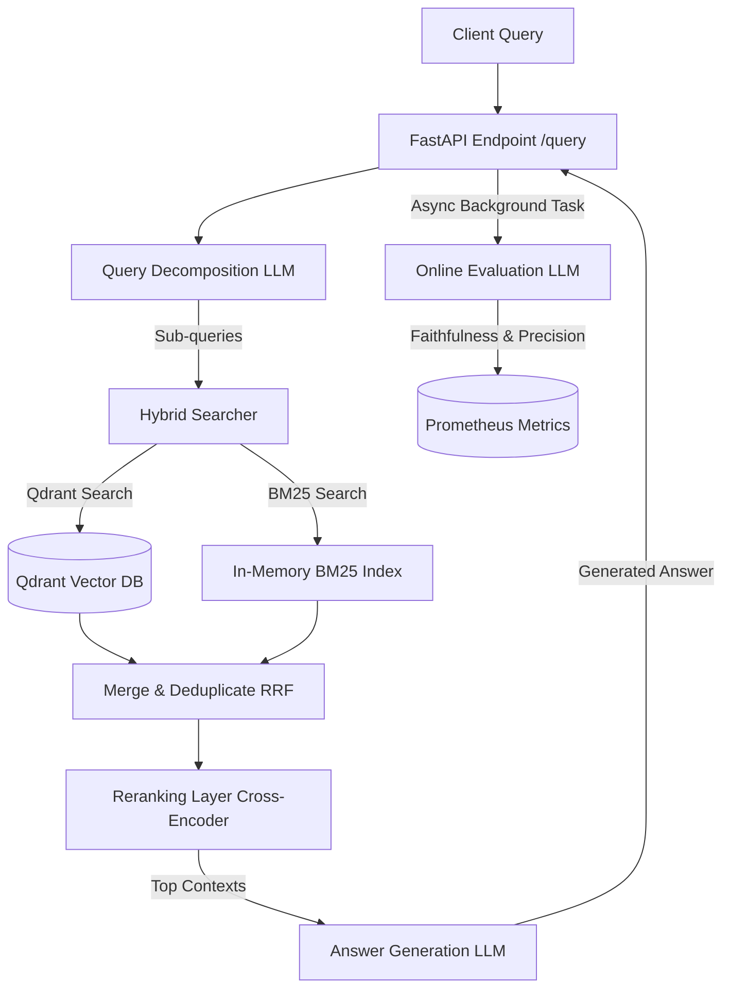

# Production-RAGOps-platform

A production-ready RAG (Retrieval-Augmented Generation) Operations platform built in Python from scratch. It features hybrid search (vector-based and keyword-based), query decomposition, reranking, online/offline LLM evaluation, and Prometheus monitoring, fully containerized using Docker and Docker Compose.

---

## Architecture Overview



---

## Tech Stack
* **Runtime**: Python 3.11
* **Web Framework**: FastAPI
* **Vector Store**: Qdrant Vector Database
* **Keyword Index**: Rank-BM25 (persisted to disk)
* **Embeddings**: `sentence-transformers/all-MiniLM-L6-v2` via HuggingFace
* **Reranker**: `cross-encoder/ms-marco-MiniLM-L-6-v2` via HuggingFace
* **LLM Integration**: OpenRouter (GPT-4o-mini, Claude 3.5 Sonnet) & Google Gemini beta API
* **Metrics**: Prometheus client
* **Containerization**: Docker, Docker Compose
* **Testing**: Pytest

---

## Directory Structure

```
ragops-platform/
├── src/
│   ├── api/             # FastAPI App, Routes
│   ├── config/          # Settings manager
│   ├── ingestion/       # Loader, Chunker, Embedder, Pipeline
│   ├── retrieval/       # Vector, BM25, Hybrid search, Decomposition, Rerank
│   ├── generation/      # LLM clients (OpenRouter / Gemini)
│   ├── monitoring/      # Prometheus metrics definitions
│   ├── evaluation/      # LLM-as-a-judge evaluators
│   └── utils/           # Logger setup
├── scripts/             # Ingestion & evaluation runners
├── tests/               # Pytest suite
├── data/                # Sample docs, Golden set, and Eval results
├── docker/              # Prometheus configs
├── requirements.txt
├── Dockerfile
├── docker-compose.yml
└── README.md
```

---

## Environment Variables

Create a `.env` file in the root directory:

```env
# API Keys (Provide at least one)
OPENROUTER_API_KEY=your_openrouter_api_key_here
GEMINI_API_KEY=your_gemini_api_key_here

# Qdrant Database Settings (Defaults to localhost)
QDRANT_URL=http://localhost:6333
COLLECTION_NAME=ragops_collection

# Default Generation Model
DEFAULT_MODEL=openai/gpt-4o-mini
```

---

## Setup and Installation

### 1. Local Python Setup

1. **Create and activate a virtual environment**:
   ```bash
   python -m venv venv
   .\venv\Scripts\activate
   ```

2. **Install dependencies**:
   ```bash
   pip install -r requirements.txt
   ```

3. **Ingest sample documents**:
   ```bash
   python scripts/ingest.py
   ```

4. **Run the FastAPI server locally**:
   ```bash
   uvicorn src.api.app:app --reload
   ```
   The API will be available at `http://localhost:8000`. Redoc documentation can be viewed at `http://localhost:8000/redoc`.

---

## Docker Deployment

To build the entire stack (FastAPI, Qdrant, and Prometheus) in containerized mode:

```bash
# Build and launch containers
docker compose up -d
```

### Services Exposed:
* **FastAPI Server**: `http://localhost:8000`
* **Qdrant Dashboard**: `http://localhost:6333/dashboard`
* **Prometheus Metrics Dashboard**: `http://localhost:9090`

---

## API Endpoints

### 1. RAG Query
* **Endpoint**: `POST /query`
* **Request Body**:
  ```json
  {
    "question": "What is the refund policy for cancellation within 24 hours?",
    "model": "openai/gpt-4o-mini"
  }
  ```
* **Response**:
  ```json
  {
    "answer": "Customers are eligible for a full 100% refund on all subscription purchases if the cancellation is requested within 24 hours of the initial transaction.",
    "contexts": [
      "24-Hour Grace Period: Cancellation within 24 hours, Details: Customers are eligible for a full 100% refund on all subscription purchases if the cancellation is requested within 24 hours of the initial transaction."
    ]
  }
  ```

### 2. Health Check
* **Endpoint**: `GET /health`
* **Response**:
  ```json
  {
    "status": "healthy",
    "qdrant": "connected"
  }
  ```

### 3. Prometheus Metrics
* **Endpoint**: `GET /metrics`
* **Response**: Prometheus scrape-ready metrics format.

---

## Evaluation Framework

The platform contains an offline evaluation runner which tests the system against a dataset of 10 golden questions and ground truths using an LLM-as-a-judge pattern.

Run the evaluation runner:
```bash
python scripts/evaluate.py
```
This writes a complete, granular evaluation report to `data/eval_results.json` containing individual and aggregated average metrics:
* **Faithfulness**: Are generated statements supported by retrieved context?
* **Context Precision**: How relevant are the retrieved chunks?
* **Context Recall**: Does retrieved context contain all details in the ground truth answer?

---

## Running Unit Tests

To verify code changes and system components:
```bash
python -m pytest
```
